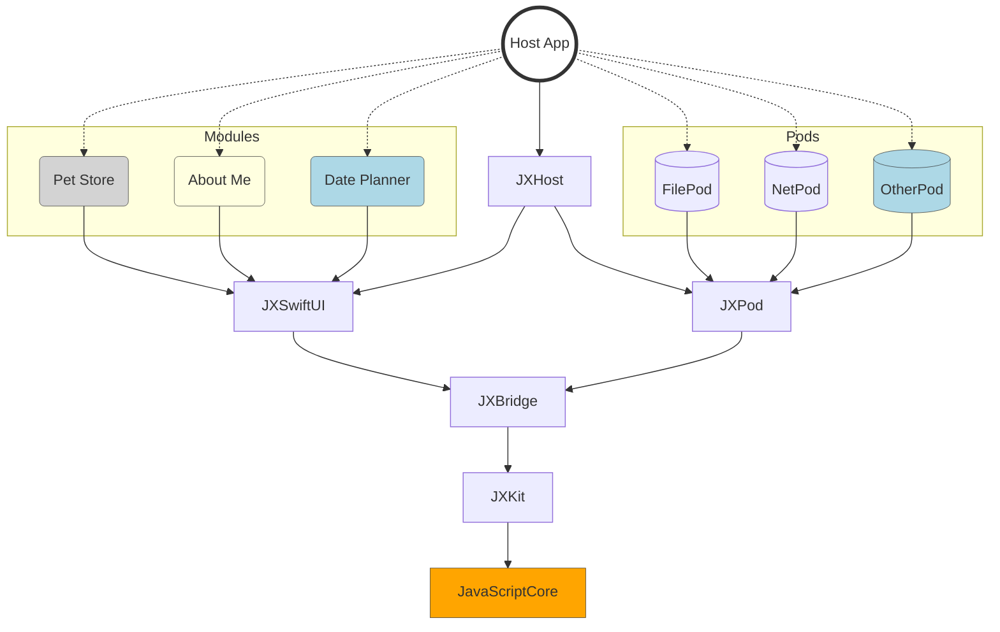
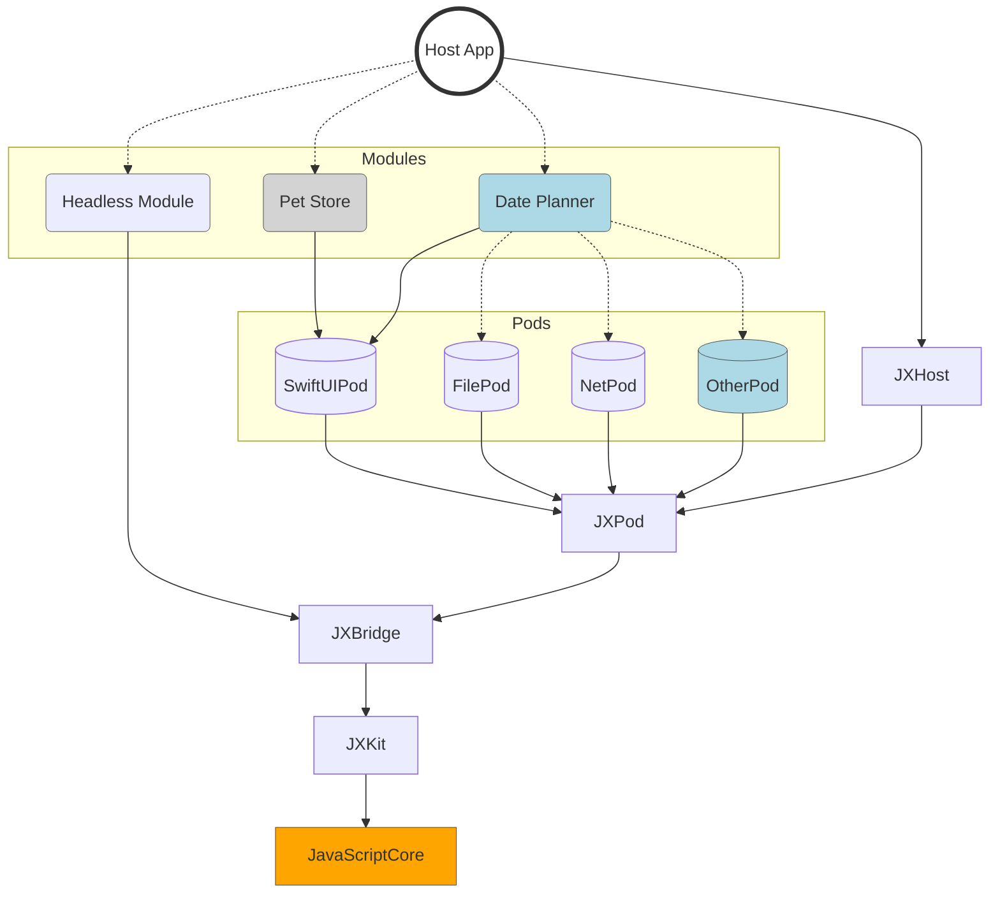

# JXHost

```mermaid
flowchart TB
    HostApp((Host App)) -.-> PetStoreModule(Pet Store)
    HostApp -.-> AboutMeModule(About Me)
    HostApp -.-> DatePlannerModule(Date Planner)
    
    HostApp --> JXHost
    
    subgraph Modules
      PetStoreModule
      AboutMeModule
      DatePlannerModule
    end

    PetStoreModule --> JXSwiftUI
    AboutMeModule --> JXSwiftUI
    DatePlannerModule --> JXSwiftUI

    JXHost --> JXSwiftUI
    JXHost --> JXPod
    JXPod --> JXBridge
    
    HostApp -.-> FilePod[(FilePod)]
    HostApp -.-> NetPod[(NetPod)]
    HostApp -.-> OtherPod[(OtherPod)]
    
    subgraph Pods
      FilePod
      NetPod
      OtherPod
    end

    FilePod --> JXPod
    NetPod --> JXPod
    OtherPod --> JXPod

    JXSwiftUI --> JXBridge
    JXBridge --> JXKit
    
    JXKit --> JavaScriptCore[JavaScriptCore]

classDef HostApp fill:white,stroke:#333,stroke-width:4px
class HostApp HostApp

classDef gray fill:lightgray,stroke:#333,stroke-width:0.5px
classDef yellow fill:lightyellow,stroke:#333,stroke-width:0.5px
classDef blue fill:lightblue,stroke:#333,stroke-width:0.5px

class PetStoreModule gray
class AboutMeModule yellow
class DatePlannerModule blue

classDef OtherPod fill:lightblue,stroke:#333,stroke-width:0.5px
class OtherPod OtherPod

classDef JavaScriptCore fill:orange,stroke:#333,stroke-width:0.5px
class JavaScriptCore JavaScriptCore

class di orange

```

# Alternate Version

```mermaid
flowchart TB
    HostApp -.-> HeadlessModule
    HostApp((Host App)) -.-> PetStoreModule
    HostApp -.-> DatePlannerModule
    
    HostApp --> JXHost
    
    subgraph Modules
      HeadlessModule(Headless Module)
      PetStoreModule(Pet Store)
      DatePlannerModule(Date Planner)
    end

    HeadlessModule --> JXBridge

    PetStoreModule --> SwiftUIPod
    
    DatePlannerModule --> SwiftUIPod
    DatePlannerModule -.-> FilePod
    DatePlannerModule -.-> NetPod
    DatePlannerModule -.-> OtherPod

    JXHost --> JXPod
    JXPod --> JXBridge

    subgraph Pods
      FilePod[(FilePod)]
      NetPod[(NetPod)]
      SwiftUIPod[(SwiftUIPod)]
      OtherPod[(OtherPod)]
    end

    FilePod --> JXPod
    NetPod --> JXPod
    SwiftUIPod --> JXPod
    OtherPod --> JXPod

    JXBridge --> JXKit
    
    JXKit --> JavaScriptCore[JavaScriptCore]

classDef HostApp fill:white,stroke:#333,stroke-width:4px
class HostApp HostApp

classDef PetStoreModule fill:lightgray,stroke:#333,stroke-width:0.5px
classDef HeadlessModule fill:lightred,stroke:#333,stroke-width:0.5px
classDef DatePlannerModule fill:lightblue,stroke:#333,stroke-width:0.5px

class PetStoreModule PetStoreModule
class HeadlessModule HeadlessModule
class DatePlannerModule DatePlannerModule

classDef OtherPod fill:lightblue,stroke:#333,stroke-width:0.5px
class OtherPod OtherPod

classDef JavaScriptCore fill:orange,stroke:#333,stroke-width:0.5px
class JavaScriptCore JavaScriptCore

class di orange

```
