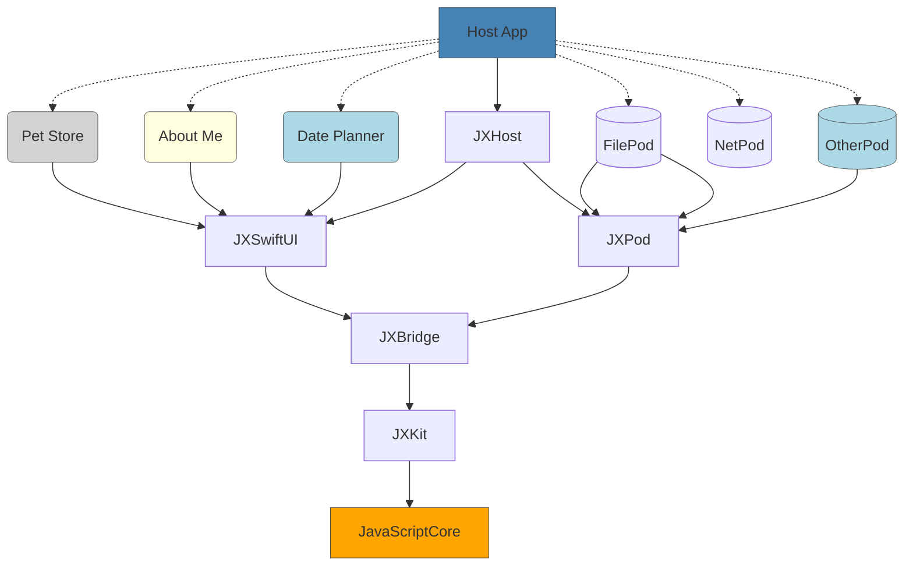

# JXHost

```mermaid
flowchart TB
    HostApp[Host App] -.-> PetStoreModule(Pet Store)
    HostApp -.-> AboutMeModule(About Me)
    HostApp -.-> DatePlannerModule(Date Planner)
    HostApp --> JXHost
    PetStoreModule --> JXSwiftUI
    AboutMeModule --> JXSwiftUI
    DatePlannerModule --> JXSwiftUI
    JXHost --> JXSwiftUI
    JXHost --> JXPod
    JXPod --> JXBridge
    HostApp -.-> FilePod[(FilePod)]
    HostApp -.-> NetPod[(NetPod)]
    HostApp -.-> OtherPod[(OtherPod)]
    FilePod --> JXPod
    OtherPod --> JXPod
    FilePod --> JXPod
    JXSwiftUI --> JXBridge
    JXBridge --> JXKit
    JXKit --> JavaScriptCore[JavaScriptCore]

classDef HostApp fill:steelblue,stroke:#333,stroke-width:0.5px
class HostApp HostApp

classDef gray fill:lightgray,stroke:#333,stroke-width:0.5px
classDef yellow fill:lightyellow,stroke:#333,stroke-width:0.5px
classDef blue fill:lightblue,stroke:#333,stroke-width:0.5px

class PetStoreModule gray
class AboutMeModule yellow
class DatePlannerModule blue

classDef OtherPod fill:lightblue,stroke:#333,stroke-width:0.5px
class OtherPod OtherPod

classDef JavaScriptCore fill:orange,stroke:#333,stroke-width:0.5px
class JavaScriptCore JavaScriptCore

class di orange

```
