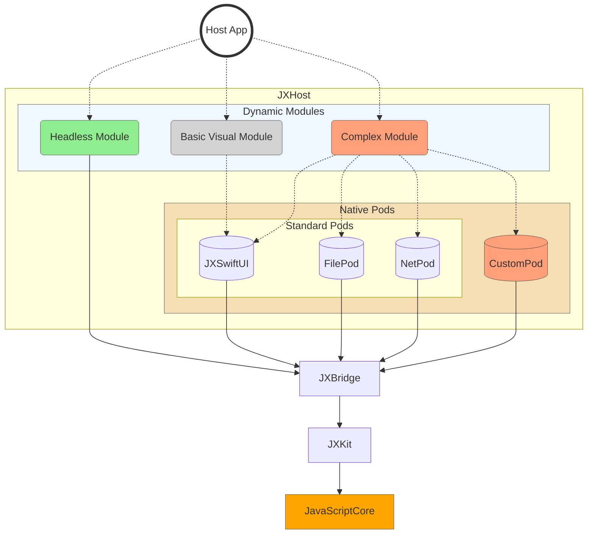

# JXHost

```mermaid
flowchart TB
    HostApp -.-> HeadlessModule
    HostApp((Host App)) -.-> BasicUIModule
    HostApp -.-> ComplexModule
            
    subgraph JXHost
      subgraph Modules[Dynamic Modules]
        HeadlessModule(Headless Module)
        BasicUIModule(Basic Visual Module)
        ComplexModule(Complex Module)
      end
      
      subgraph Pods[Native Pods]
        subgraph StandardPods[Standard Pods]
          SwiftUIPod[(JXSwiftUI)]
          FilePod[(FilePod)]
          NetPod[(NetPod)]
        end
        CustomPod[(CustomPod)]
      end
    end
    
    HeadlessModule --> JXBridge

    BasicUIModule -.-> SwiftUIPod
    
    ComplexModule -.-> SwiftUIPod
    ComplexModule -.-> FilePod
    ComplexModule -.-> NetPod
    ComplexModule -.-> CustomPod

    FilePod --> JXBridge
    NetPod --> JXBridge
    SwiftUIPod --> JXBridge
    CustomPod --> JXBridge

    JXBridge --> JXKit
    
    JXKit --> JavaScriptCore[JavaScriptCore]

classDef HostApp fill:white,stroke:#333,stroke-width:4px
class HostApp HostApp

classDef BasicUIModule fill:lightgray,stroke:#333,stroke-width:0.5px
class BasicUIModule BasicUIModule

classDef HeadlessModule fill:lightgreen,stroke:#333,stroke-width:0.5px
class HeadlessModule HeadlessModule

classDef ComplexModule fill:lightsalmon,stroke:#333,stroke-width:0.5px
class ComplexModule ComplexModule

classDef CustomPod fill:lightsalmon,stroke:#333,stroke-width:0.5px
class CustomPod CustomPod

classDef Modules fill:aliceblue,stroke:#333,stroke-width:0.5px
class Modules Modules

classDef Pods fill:wheat,stroke:#333,stroke-width:0.5px
class Pods Pods

classDef JavaScriptCore fill:orange,stroke:#333,stroke-width:0.5px
class JavaScriptCore JavaScriptCore

class di orange

```
